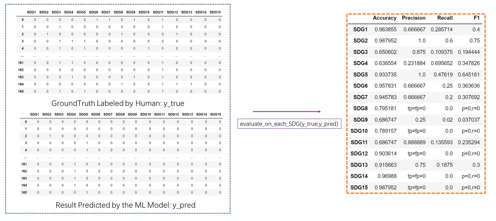

This function is used to **evaluate** the classification performance of a machine learning model on a multi-label dataset. The evaluation metrics include **Accuracy, Precision, Recall, F1**, and gives an assessment of the model's performance **on each category**.

The code in the ipynb file is the same as the code in the py file. If you want to visualize how this function is used and what the input is and what the output is, please refer to the ipynb file. If you need to use this interface directly in your own code via the import method, download the py file.

**usage:**
<pre><code>from multieva import evaluate_on_each_SDG
evaluate_on_each_SDG(y_true,y_pred)
</code></pre>

