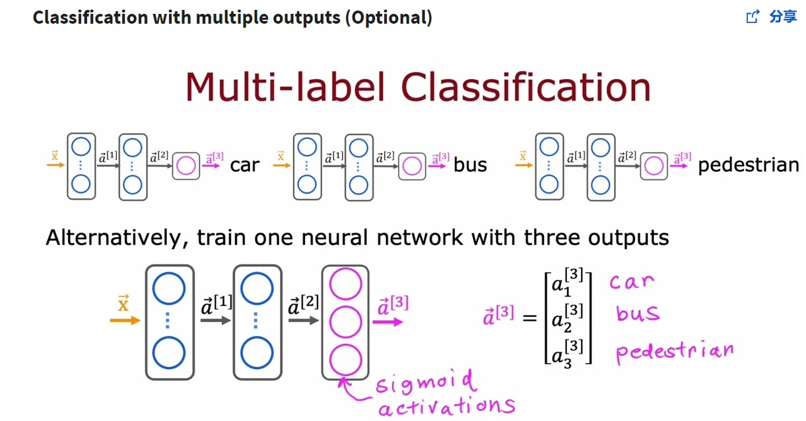
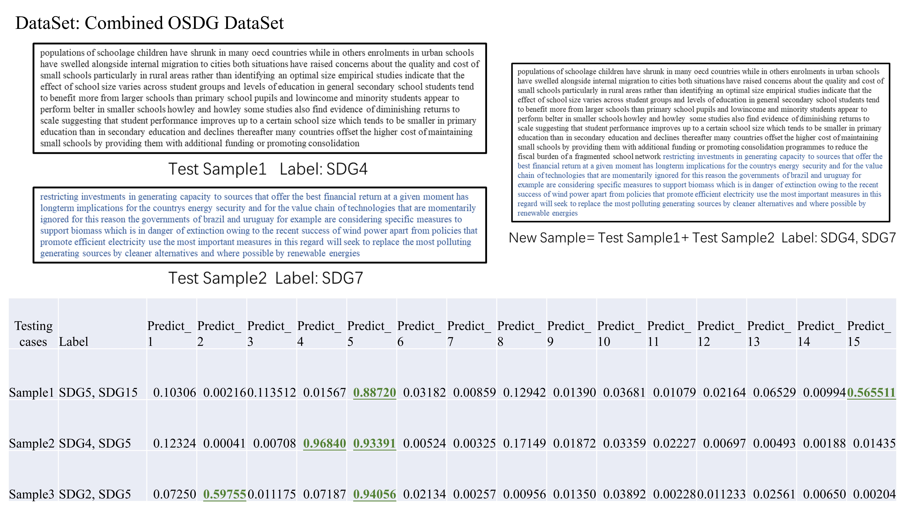

Dataset: Combined OSDG dataset, a multi-label classification dataset.  
Algorithm: GRU  
**Notice that the last layer is: Dense(15, activation='sigmoid')), 
The activation function is set here to sigmoid instead of softmax to adapt to Multi-label Classification.**  
  
**Details:**  
Dense(15, activation='sigmoid')) can give 15 **independent** outputs, each output is from 0 to 1,
represent the probability of the corresponding SDG.
**Conversely**, softmax requires the summation of all outputs is 1, it is not applicable in Multi-label problems.  
See more details on <https://www.coursera.org/lecture/advanced-learning-algorithms/classification-with-multiple-outputs-optional-pjIk0>  
  
An example:  
  
Accuracy on training: 0.6146  
Accuracy on validation: 0.5745  
thus not good enough yet, but shows potentiality to deal with multi-label classification problems.
